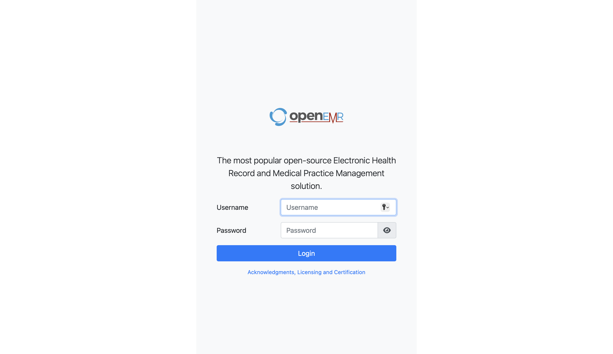

# Para Trabajar con Openemt

-  Este este proyecto se despleega en docker compose listo para trabajar y realizar registro de pacientes, el cual esta enlazado a base de datos MariaDB y administrado por PgAdmind.

- Este proyecto se despliega usando comandos desde el archivo Makefile, para usar el codigo deben asegurar que tienen instalado el programa make y por supuesto Docker para que se puedan instalar los programas. 
- Una vez que tengan instalado el programa docker y make.
- En Macbook pueden instalar brew desde la pagina oficial para administrar brew si es microsoft pueden instalar chocolate para poder correr los comandos. En microsoft checar que tenga algunos ajuste para uso de maquina virtual para que se pueda install docker.  Si ya tienen instalado un subsitetema de linux, se instala sin problemas.

1. Instalar docker descargandolo desde la pagina oficial.
- https://www-docker-com.translate.goog/products/docker-desktop/?_x_tr_sl=en&_x_tr_tl=es&_x_tr_hl=es&_x_tr_pto=tc
2. Instalar make con brew. 
- https://brew.sh/    
copiar y pegar lo siguiente en el terminal.

```bash 
    /bin/bash -c "$(curl -fsSL https://raw.githubusercontent.com/Homebrew/install/HEAD/install.sh)"
``` 

3. Install make 

```bash
    brew install make
```

4. Desde el terminar escribir los siguiente para install los programas del archivo docker compose. 

```bash
    make up  # y en automático se instalan los contenedores. 
```


"Algo muy importante debe asegurarse de que estan en el directorio de trabajo donde esta el archivo docker-compose.yaml 
En su computadora busquen terminal, el terminal en automatico los llevara al directorio home. Para saber en donde se encuentrar desde el terminal pueden poner "pwd" en el terminar y les diran en que directorio estan  "/workspaces/openemr-workflow"y puego ponen "ls" veran lo siguente:

```bash
    -rw-rw-rw- 1 codespace codespace  205 Jan  2 01:59 Makefile
    -rw-rw-rw- 1 codespace root      1427 Jan  2 02:23 README.md
    -rw-rw-rw- 1 codespace codespace  912 Jan  2 01:52 docker-compose.yaml
este último comando les dirá qué archivo tienen en su directorio, deberían de visualizar los archivos Docker-file, README.md y Makefile como lo anterio`
```

```bash
    pwd 
    ls
```

Cuando se termine de instalar los programas, ponga en el terminal  docker ps y vera los contenedores corriendo y listo para usar. 
```bash
docker ps 
```
Verá algo como lo siguiente.

```bash
CONTAINER ID   IMAGE                   COMMAND                  CREATED          STATUS          PORTS                                                                                NAMES
b5383348bb37   openemr/openemr:7.0.2   "./openemr.sh"           31 minutes ago   Up 10 minutes   0.0.0.0:8200->80/tcp, [::]:8200->80/tcp, 0.0.0.0:8443->443/tcp, [::]:8443->443/tcp   openemr
192749b7f028   phpmyadmin              "/docker-entrypoint.…"   31 minutes ago   Up 10 minutes   0.0.0.0:8080->80/tcp, [::]:8080->80/tcp                                              pma-openemr
112d4f23dea9   mariadb:10.11           "docker-entrypoint.s…"   31 minutes ago   Up 10 minutes   3306/tcp    `
                mysql
```

Nos dará informacion del terminla que estan usand los contendores que tenemos instalado y que ya se puede usar. 
Ahora entramos al siguiente enlace desde nuestro navegador. http://localhost/8200 y veremos algo como lo siguiente



A continuar entramos con nuestro usuario y contraseña que definimos en el archivo docker-compose.yaml.

Algo importante que deben saber es que los puertos estan expuestos a nuestra red local, lo que quiere decir que se puede acceder con nuestro usuario desde una computadora que esta conectado a una red local de internet, solo el administrador y el programa openemr. Se pueden hacer ajustes de acuerdo a las necesidades. 

