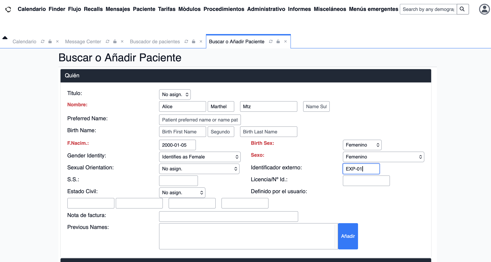
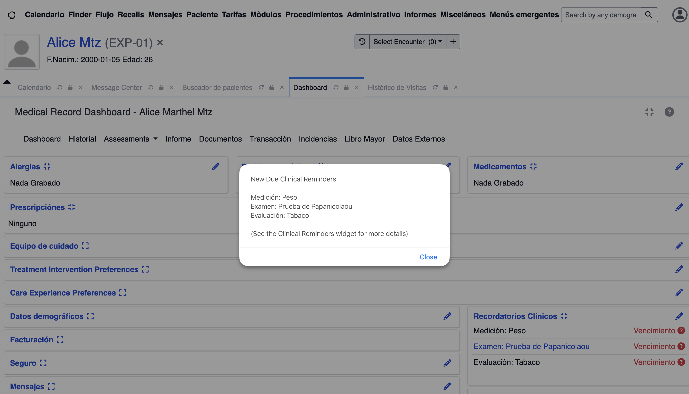
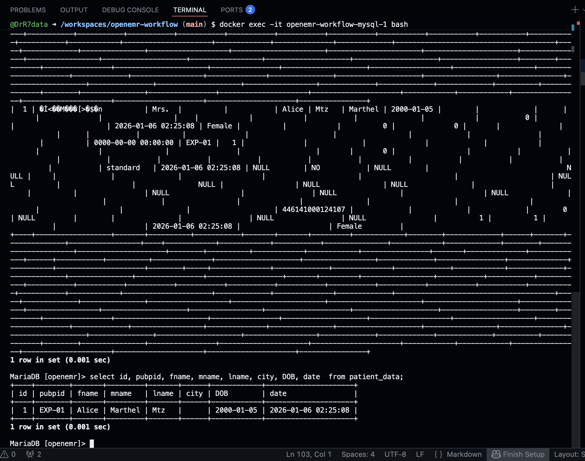

# Para Trabajar con Openemr
-  Este proyecto se despliega con docker-compose listo para trabajar y realizar registro de pacientes, el cual está enlazado a base de datos MariaDB y administrado por PgAdmind.

- Este proyecto se despliega usando comandos desde el archivo Makefile, para usar el codigo deben asegurar que tienen instalado el programa make y por supuesto Docker para que se puedan instalar los programas dentro de los contenedores. 
- Una vez que tengan instalado el programa docker y make.
- En Macbook pueden instalar brew desde la pagina oficial para administrar brew, por otro lado, si usan microsoft pueden instalar chocolate para poder correr los comandos. En microsoft, checar que tenga algunos ajustes para uso de maquina virtual para que se pueda install docker.  Si ya tienen instalado un subsistema de linux, se instala sin problemas.

1. Instalar docker descargandolo desde la pagina oficial:
- https://www-docker-com.translate.goog/products/docker-desktop/?_x_tr_sl=en&_x_tr_tl=es&_x_tr_hl=es&_x_tr_pto=tc

2. Instalar make con brew. 
- https://brew.sh/    
copiar y pegar lo siguiente en el terminal.

```bash 
/bin/bash -c "$(curl -fsSL https://raw.githubusercontent.com/Homebrew/install/HEAD/install.sh)"
``` 

3. Instalar programa make y git en macbook 

```bash
brew install make git
```

4. Desde el terminal escribir los siguiente para que se descarguen los archivos con git
```bash
git clone https://github.com/DrR7data/openemr-workflow.git
cd openemr-workflow
```
una vez que esten dentro del directorio openemr-workflow, puede averiguar si estar en el directorio con 
```bash
pwd # para ver el nombre del directorio.
ls # para ver los archivos 
```
para install los programas del archivo docker compose pueden usar **make up** or escibiendo docker compose up -d, en lo personal prefiero usar el proegrama make que ejecuta los comando en el archivo Makefile, para probar lo que hace puede probarlo solo escirbiendo make en la linea de comandos y verás un mensaje "For Work With openemr" en la que se ejecuta el  primer comando header por defaul, pero ustedes pueden espesicar el comando que quierene ejecutar.

```bash
make up  # y en automático se instalan los contenedores. 
```
Agregué -d al final de comando **docker compose up -d** para que para no se vean las lineas de codigo en la pantalla del temrinal y como se está instando cada capa, pero si gustan pueden quitar -d para visualizarlo.
Depende de la velocidad de su internet, puede tomar un poco de tiempo, porque se descargaran 2 programas con una carga total de aprox. 2 GB en total, después de la descarga verán algo como lo siguiente al realizar el siguiente comando, 
```
    docker images
```

```bash

REPOSITORY        TAG       IMAGE ID       CREATED         SIZE
openemr/openemr   7.0.4     d7f15a1bae87   12 days ago     1.62GB
mariadb           11.8      f57b654bf058   7 weeks ago     334MB

```
Si gustan pueden descargar programa por separado antes de correr el archivo docker-compose.yml con los sigueintes comandos

```bash
docker pull openemr/openemr:7.0.4 
docker pull mariadb:11.8  

```


5. "Algo muy importante, deben asegurarse de que estan en el directorio de trabajo donde está el archivo docker-compose.yaml 
En su computadora busquen terminal, el terminal en automático abre en el directorio home. Para saber en dónde se encuentran desde el terminal pueden poner "pwd" en el terminar y les diran en que directorio están  "/workspaces/openemr-workflow"y puego ponen "ls" y verán lo siguente:

```bash
    -rw-rw-rw- 1 codespace codespace  205 Jan  2 01:59 Makefile
    -rw-rw-rw- 1 codespace root      1427 Jan  2 02:23 README.md
    -rw-rw-rw- 1 codespace codespace  912 Jan  2 01:52 docker-compose.yaml
```

Este último comando les dirá qué archivo tienen en su directorio, deberían de visualizar los archivos Docker-file, README.md y Makefile como lo anterior:

```bash
pwd 
ls
```

Cuando se termine de instalar los programas, pongan en el terminal  "docker ps" y verán los contenedores corriendo y listo para usar. 

```bash
docker ps 
```
Verán algo como lo siguiente.

```bash
CONTAINER ID   IMAGE                   COMMAND                  CREATED          STATUS                    PORTS                                                                          NAMES
a3ede1951b36   openemr/openemr:7.0.4   "./openemr.sh"           16 minutes ago   Up 16 minutes (healthy)   0.0.0.0:80->80/tcp, [::]:80->80/tcp, 0.0.0.0:443->443/tcp, [::]:443->443/tcp   openemr-workflow-openemr-1
ec382c976549   mariadb:11.8            "docker-entrypoint.s…"   16 minutes ago   Up 16 minutes (healthy)   3306/tcp                                                                       openemr-workflow-mysql-1
```

Nos dará información del terminal que estan usando los contendores que tenemos instalado y listos para ser usados. 
Ahora entramos al siguiente enlace desde nuestro navegador. http://localhost/80 y veremos algo como lo siguiente:


A continuación entramos con nuestro usuario y contraseña que definimos en el archivo docker-compose.yaml.

Algo importante que deben saber es que los puertos estan expuestos a nuestra red local, lo que quiere decir que se puede acceder con nuestro usuario desde una computadora que está conectado a una red local de internet, solo el administrador y el programa openemr. Se puede realizar ajustes de acuerdo a las necesidades. 

Pagina Oficial [openemr](https://www.open-emr.org/)

## Para anaddir a un paciente:

## Dashboard del paciente


Y si entramos a la base de datos veremos los siguiente: 
```bash
mariadb -u root -p #Ponemos la contraseña
show databases;
use openemr;
select * from patient_data; #Veremos todas las columnas de la tabla 
select id, pubpid, fname, mname, lname, city, DOB, date  from patient_data;

```
Veremos que nuestro paciente ya está registrado en nuestra base de datos MariaDB.

## Dashboard del paciente
